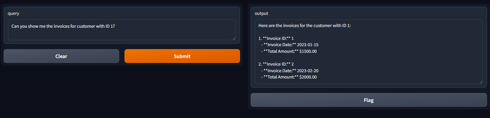

> [!NOTE]
> Documentation auto-generated by [ai-docs.](https://github.com/connor-john/ai-docs)

# Introduction



This project is an AI-powered database agent that can query invoice and timesheet information from test tables using natural language processing. The agent is built using Python and utilizes the Langchain library with OpenAI's GPT-4 model for language understanding and generation. The application is wrapped in a user-friendly Gradio interface, allowing users to interact with the AI agent through a web browser.

# Codebase Overview
The codebase follows a modular architecture, separating concerns into distinct functions and components. The main components include:

1. Database connection and query functions
2. AI agent initialization and message processing
3. Gradio interface setup and launch

The application uses the `dotenv` library to load environment variables for secure database connection details. The `pyodbc` library is used to establish a connection to a Microsoft SQL Server database and execute queries. The `langchain` library, specifically the `ChatOpenAI` class, is used to initialize and interact with the OpenAI GPT-4 model.

# Development Environment Setup
To set up the development environment, follow these steps:

1. Install Python 3.9 or later.
2. Install Poetry, a dependency management tool for Python projects.
3. Clone the project repository.
4. Navigate to the project directory and run `poetry install` to install the required dependencies.
5. Create a `.env` file in the project root and add the necessary environment variables (e.g., `DB_SERVER`, `DB_NAME`, `DB_USERNAME`, `DB_PASSWORD`).

# Code Repository Structure
The repository structure is as follows:

```
ai-db-agent/
│
├── ai-db-agent/
│   └── run.py
│
└── pyproject.toml
```

- `ai-db-agent/run.py`: The main Python script containing the application logic.
- `pyproject.toml`: The Poetry configuration file defining project dependencies and metadata.

# Key Points of Complexity
1. Database Connection and Querying:
   - The `connect_to_db()` function establishes a connection to the Microsoft SQL Server database using the `pyodbc` library and environment variables for secure connection details.
   - The `get_invoices_for_customer()` and `get_timesheets_for_employee()` functions execute SQL queries to retrieve data from the respective tables based on the provided customer or employee ID.
   - The retrieved data is serialized into JSON format for further processing.

2. AI Agent Initialization and Message Processing:
   - The `ChatOpenAI` class from the `langchain` library is used to initialize the GPT-4 model with specific parameters (e.g., model name, temperature).
   - The `chatbot()` function processes user queries by constructing a sequence of messages, including a system message, human message, and any additional messages generated during the conversation.
   - If the AI model requests a function call (e.g., `get_invoices_for_customer()`), the corresponding function is executed, and the result is sent back to the model for generating the final response.

3. Gradio Interface Setup and Launch:
   - The Gradio library is used to create a user-friendly web interface for interacting with the AI agent.
   - The `Interface` class is instantiated with the `chatbot()` function as the main input/output handler.
   - The `launch()` method is called to start the Gradio server, making the interface accessible through a web browser.

# Installation and Setup
To install and set up the project, follow these steps:

1. Ensure you have Python 3.9 or later installed.
2. Clone the project repository.
3. Navigate to the project directory.
4. Install Poetry by running `pip install poetry`.
5. Run `poetry install` to install the project dependencies.
6. Create a `.env` file in the project root and add the necessary environment variables (e.g., `DB_SERVER`, `DB_NAME`, `DB_USERNAME`, `DB_PASSWORD`).

# Getting Started
To start using the AI database agent, follow these steps:

1. Ensure you have completed the installation and setup process.
2. Run the `run.py` script using the command `poetry run python ai-db-agent/run.py`.
3. The Gradio interface will be launched, and you will see a message indicating the URL where you can access the interface (e.g., `http://127.0.0.1:7860` or `http://localhost:7860`).
4. Open the provided URL in your web browser.
5. Enter your query in the input textbox and press Enter or click the "Submit" button.
6. The AI agent will process your query and display the response in the output area.

Feel free to explore the AI database agent and experiment with different queries related to customer invoices and employee timesheets!